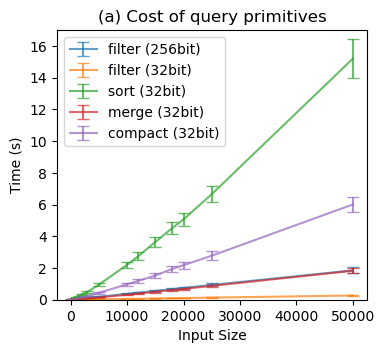
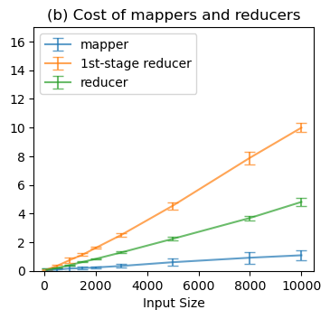
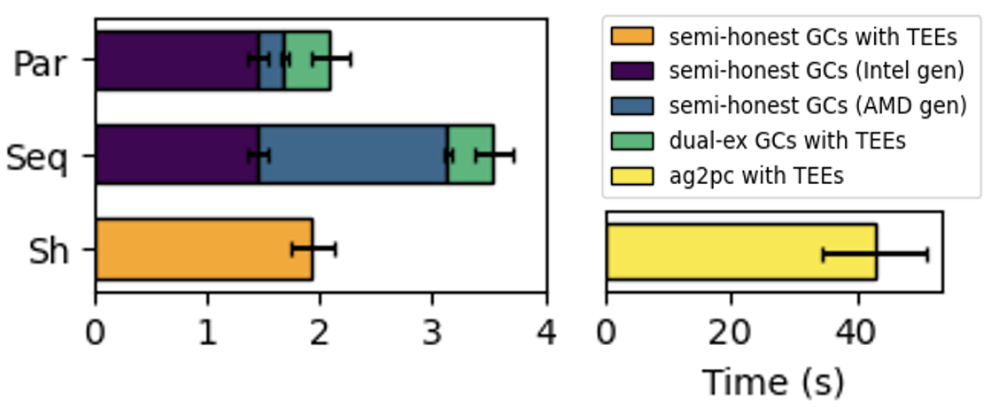
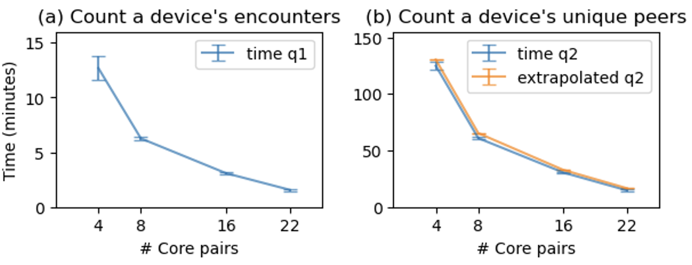

# CoVault


**Note**: CoVault is not actively maintained. This is an academic prototype and it is not ready for production use.

---

CoVault is an analytics platform for secure computation that enables the analysis of personal data, such as individuals' mobility, financial, and health data, while maintaining strong security guarantees. CoVault leverages server-aided multi-party computation (MPC) and trusted execution environments (TEEs) to colocate MPC parties in a single datacenter without reducing security, and scales MPC horizontally to the datacenter's available resources.

The artifact in this repository accompanies our USENIX Security 2025 paper:

[CoVault: Secure, Scalable Analytics of Personal Data](https://www.usenix.org/conference/usenixsecurity25/presentation/de-viti). *Roberta De Viti, Isaac Sheff, Noemi Glaeser, Baltasar Dinis, Rodrigo Rodrigues, Bobby Bhattacharjee, Anwar Hithnawi, Deepak Garg, and Peter Druschel.* USENIX Security 2025.

<p align="center">
  
  
  
</p>

This artifact includes the code to reproduce the results in the paper. This artifact passed availability, functionality, and reproducibility evaluation at USENIX Security 2025. (See the USENIX Security 2025 [artifact page](https://secartifacts.github.io/usenixsec2025/badges).)

## Setup

To facilitate artifact evaluation, we provide USENIX Security evaluators with SSH access to pre-configured virtual machines (VMs) on Google Cloud Compute Engine (GCE). These VMs include all necessary hardware and software dependencies and are set up for intercommunication and mutual authentication. We refer to this as the “GCE setup,” intended for USENIX Security evaluators.

Additionally, this file provides step-by-step instructions for users to configure their own machines for running CoVault, provided they meet the requirements (see Sec. A.2 in CoVault's artifact appendix). We refer to this as the “generic setup”, intended for general users.

## Table of contents

- [Repository Structure](#repository-structure)
    - [Simplified Repository Tree](#simplified-repository-tree)
    - [Repository Structure Overview](#repository-structure-overview)
- [Pre-Requisites](#pre-requisites)
    - [GCE Setup](#gce-setup)
    - [Generic Setup](#generic-setup)
- [Reproduce Results](#reproduce-results)
    - [Background](#background)
    - [Primitives (Sec. 6.2, Figure 4a)](#primitives-sec-62-figure-4a)
      - [GCE Setup](#gce-setup-1)
      - [Generic Setup](#generic-setup-1)
    - [Mappers and Reducers for Query q2 (Sec. 6.2, Figure 4b)](#mappers-and-reducers-for-query-q2-sec-62-figure-4b)
      - [GCE Setup](#gce-setup-2)
      - [Generic Setup](#generic-setup-2)
    - [Cost Breakdown: Sort 10,000 32-bit elements (Sec. 6.2, Figure 3)](#cost-breakdown-sort-10000-32-bit-elements-sec-62-figure-3)
      - [GCE Setup](#gce-setup-3)
      - [Generic Setup](#generic-setup-3)
    - [Queries q1 and q2 (Sec. 6.3, Figure 6)](#queries-q1-and-q2-sec-63-figure-6)
      - [GCE Setup](#gce-setup-4)
      - [Generic Setup](#generic-setup-4)
    - [Query units for extrapolation (Sec. 6.3, Figure 6 (yellow line) and 6.3.1](#query-units-for-extrapolation-sec-63-figure-6-yellow-line-and-631)
      - [GCE Setup](#gce-setup-5)
      - [Generic Setup](#generic-setup-5)
- [Publication](#publication)
- [Contact](#contact)

## Repository Structure

This section provides an overview of the project's directory layout, explaining the purpose of each main folder.

### Simplified Repository Tree

```
├── bench
├── circuits
├── cmake
├── include
├── results
├── run
├── sbin
├── src
├── test
├── third_party
├── utils
├── CMakeLists.txt
├── LICENSE
├── README.md
├── redis_setup.sh
├── setup.sh
├── sort10k_gen.txt
├── extrapolation_results.txt

28 directories, 199 files
```

### Repository Structure Overview

- `bench/`: Contains test input files for performance evaluation and scripts to generate them.
- `circuits/`: Stores cryptographic circuit definitions in Bristol formats.
- `cmake/`: Holds CMake configuration files for project build settings.
- `include/`: Header files defining key data structures and functions.
- `results/`: Stores output data from benchmarks and experiments.
- `run/`: Contains shell scripts for executing different experiments and tests.
- `sbin/`: Setup and utility scripts for system configurations.
- `src/`: Core source code implementation of the project's basic building blocks.
- `test/`: Unit and integration test implementations.
- `third_party/`: External dependencies and libraries.
- `utils/`: Scripts for data processing, parsing, and visualization.
- Project Root Files:
    - `CMakeLists.txt`: Configuration for CMake build system.
    - `LICENSE`: Project licensing information.
    - `README.md`: Documentation and overview of the project.
    - `redis_setup.sh`, `setup.sh`: Setup scripts for environment configuration.

## Pre-Requisites

### GCE setup
If you are a USENIX Security evaluator with SSH keys for the GCE setup, you can skip this step—the VMs are already configured with the CoVault prototype in `~/covault`. In this README, we indicate on which VM to run each experiment. You can proceed directly to [Reproduce Results](#reproduce-results). Otherwise, follow the instructions below to set up your system and install the CoVault prototype.

### Generic setup

This artifact has been tested on the following platforms:
- Debian GNU/Linux 12 (bookworm)
- Ubuntu 22.04.4 LTS (Jammy Jellyfish)

#### 1. Install Dependencies and CoVault

Run the following command as root (or with sudo) to set up the environment:
``` 
./setup.sh
```
This script will:

- Install all required dependencies.
- Disable CPU frequency scaling.
- Download and configure the EMP toolkit libraries.
- Apply CoVault-specific changes to the libraries.
- Compile the EMP libraries and the CoVault application.
- Setup two Redis instances.

#### 2. Populate Redis Database

To populate Redis with a synthetic dataset, use the `ingress` and `ingress_gv` circuits:

```
./build/bin/ingress bench/ingress_a.json & ./build/bin/ingress bench/ingress_b.json
./build/bin/ingress_gv bench/ingress_a.json & ./build/bin/ingress_gv bench/ingress_b.json 
```

To verify the inserted data, connect to the Redis instance on the machine where it is set up:
```
redis-cli -a [password] -p [port]
> KEYS *
```

Replace [password] with your Redis password and [port] with the appropriate port number for the instance you want to query.
The ports set up by `setup.sh` are 6379 and 6380 for the generator and the evaluator, respectively.

To configure Redis to start at system start up, you can and append the following lines to your `~/.bashrc` file:
```
sudo systemctl start redis
sudo systemctl start redis_6380
```

#### 3. Basic test

Running the `ingress_gv` circuit is already an indication that the system is working properly. Another basic test is the execution of the `primitives` script in the next section.

## Reproduce results

### Background

#### 2PC setting

CoVault's prototype runs Two-Party Computation (2PC) using Garbled Circuits (GCs) implemented with [EMP Toolkit](https://github.com/emp-toolkit). A typical GC execution involves two machines (parties): a generator (Alice) and an evaluator (Bob). Throughout this README, we refer to **pairs** of machines or parties, and all scripts should be run on both.

#### Running the scripts

Although not strictly required, we recommend running the scripts on both machines as close in time as possible. In rare cases, we found that if the generator starts significantly earlier than the evaluator, the connection in the underlying EMP Toolkit may hang, requiring a restart. Although uncommon, this issue can easily be avoided by launching the scripts on both machines nearly concurrently.

#### Using TMUX

We recommend running all scripts within TMUX and ignoring the on-screen output, which can even be redirected to `/dev/null`. The output formatting may appear skewed due to prints from the underlying EMP Toolkit when running concurrent processes in the same shell—this is expected and not an issue.

Results are saved in a CSV file, while the on-screen output is primarily for debugging. It helps verify that processes start correctly (EMP displays "connected" when they do) and that parameters are set properly. Once confirmed, you can leave the scripts running and open another TMUX tab to, e.g., check the results.

#### Measuring performance

For accurate performance measurements, avoid running other processes on the machines and wait for the required duration.

### Primitives (Sec. 6.2, Figure 4a)



#### GCE Setup

*Human hours*: ~2 minutes.

*Compute hours*: ~1-2 days, with the default number of repetitions.

*Execution*: SSH into the tdx01 and snp01 VMs, then `cd` to `~/covault`. Both VMs are pre-configured to reproduce the results from the paper: no modifications to scripts or configuration files are needed. Simply run the following script on both VMs:
```
./run/primitives_run.sh
```
To adjust the number of repetitions, edit `N_REPS` in the script. However, we recommend using the default value, which takes ~1-2 days to complete.

*Results*: SSH into the tdx01 VM. Once execution is complete, the raw results from both VMs will be in `~/covault/results/primitives`, and the plot for Figure 4a will be in `~/covault/results/`.

#### Generic Setup

Let us assume that the main folder of the artifact is `~/covault/`. After selecting a generator and an evaluator machine, configure the following parameters:

*Configuration*:
1. Configure `CONFIG.me`. Create this file in the main folder of the artifact; it's a Bash-format config file that will be sourced by the run scripts:
    - `party`: Defines the party role. Set to "a" for the generator or "b" for the evaluator.
    - `peer_ip_1` and `peer_ip_2`: The IP addresses of the opposite party's machine. If the hardware supports two network interfaces, set both IPs to enable traffic splitting (e.g., for DualEx). Otherwise, use the same IP for both fields. If running on localhost for debugging, execute the script twice on the same machine, once per party role.
    - `scp_peer`: The IP address where raw results should be transferred via scp. Comment this out on the other machine unless you want both to store all results (which is unnecessary).

2. Configure `./run/primitives_run.sh`:
    - `DUALEX`: Set whether to use DualEx (default: yes).
    - `N_REPS`: Set the number of repetitions for execution (default: 1000).

*Execution*:
Execute the script on both machines:
```
./run/primitives_run.sh
```
**Note**: this script requires sudo permissions. However, it is possible to run it in userspace by commenting out the lines setting the niceness.

*Results*:
Once execution is complete, the raw results from both machines will be stored in `~/covault/results/primitives/` on the designated machine. The plot for Figure 4a will be saved in `~/covault/results/`.

### Mappers and Reducers for Query q2 (Sec. 6.2, Figure 4b)



#### GCE Setup 

*Human hours*: ~5 minutes.

*Compute hours*: 1 day per configuration (~2 days total), with the default number of repetitions.

*Execution*: SSH into the tdx01 and snp01 VMs, then `cd` to `~/covault`. Both VMs are pre-configured to reproduce the results from the paper: no modifications to scripts or configuration files are needed. Simply run the following script on both VMs:
```
./run/mapper_reducer_run.sh
```
To adjust the number of repetitions, edit `N_REPS` in the script. However, we recommend using the default value, which takes ~1 day to complete.

By default, the script tests a 1st-stage reducer (yellow line). To test an i-th stage reducer (green line), modify `run/mapper_reducer_run.sh`, changing `LAYER=1` to `LAYER=2` on both VMs, then re-run the script on both VMs.

*Results*: SSH into the tdx01 VM. Once the script has been run for both types of reducers, the raw results from both VMs will be in `~/covault/results/mapper_reducer`. To generate the plot for Figure 4b, run:
```
python3 utils/plots/plot_mappers_reducers.py results/mapper_reducer
```
This script saves the plot to `~/covault/results/`.

#### Generic Setup

Let us assume that the main folder of the artifact is `~/covault/`. After selecting a generator and an evaluator machine, configure the following parameters:

*Configuration*:
1. Configure `CONFIG.me` as in the [Primitives](#generic-setup-1) section.

2. Configure `./run/mapper_reducer_run.sh`:
    - `DUALEX`: Set whether to use DualEx (default: yes).
    - `N_REPS`: Set the number of repetitions for execution (default: 1000).
    - `LAYER`: Set the type of reducer to 1 for a 1st-stage reducer or 2 for an i-th stage reducer.

*Execution*:
Execute the script on both machines:
```
./run/mapper_reducer_run.sh
```
**Note**: this script requires sudo permissions. However, it is possible to run it in userspace by commenting out the lines setting the niceness.

*Results*:
Once execution is complete, the raw results from both machines will be stored in `~/covault/results/mapper_reducer/` on the designated machine. To generate the plot for Figure 4b, run:
```
python3 utils/plots/plot_mappers_reducers.py results/mapper_reducer
```
This script saves the plot to `~/covault/results/`.


### Cost Breakdown: Sort 10,000 32-bit elements (Sec. 6.2, Figure 3)

This figure is generated by running `primitives_run.sh` (see [Primitives](#primitives-sec-62-figure-4a) above) on various machine configurations and comparing the performance of the sort primitive with 10,000 elements, in particular. 



#### GCE Setup 

*Human hours*: ~10 minutes.

*Compute hours*: 12-24h per configuration (~3-4 days total), with the default number of repetitions.

*Setting*: Google Cloud does not allow switching TEEs on and off within the same VM. To ensure fair comparisons, we use separate VMs with and without Confidential Compute with identical specifications: `c3-standard-8` (Intel) and `n2d-standard-8` (AMD) VMs in the `us-central1-a` region.

Thus, `primitives_run.sh` must be executed on different VMs depending on the TEE status:
- TEE off: intel01 and amd01
- TEE on: tdx01 and snp01

*Execution*: The configuration files are pre-set, requiring minimal modifications. Follow these steps to reproduce each of the five bars in Figure 3:

1. `Semi-Honest GC (Intel Generator)`: 
    - SSH into the intel01 and amd01 VMs, then `cd` to `~/covault`.
    - Run `./run/primitives_run.sh` on both VMs. (The code on these VMs is pre-configured to test only the sort primitive with 10,000 elements, skipping unnecessary tests.)

2. `Semi-Honest GC (AMD Generator)`: 
    - SSH into the intel01 and amd01 VMs, then `cd` to `~/covault`. 
    - Edit `CONFIG.me` on both VMs to swap party roles: set `party=a` on amd01 and `party=b` on intel01. 
    - Re-run `./run/primitives_run.sh` on both VMs.

3. `DualEx GCs with TEEs`: if you already executed `./run/primitives_run.sh` on tdx01 and snp01 as in [Primitives](#primitives-sec-62-figure-4a), no additional steps are needed. Later, another script will filter the sort latency for 10,000 elements from those results.

4. `Semi-Honest GC with TEEs`: 
    - SSH into the tdx01 and snp01 VMs, then `cd` to `~/covault`. 
    - Edit `run/primitives_run.sh` on both VMs to change `DUALEX=1` to `DUALEX=0`. 
    - To highlight the TEE overhead in the plot, swap party roles: edit `CONFIG.me` on both VMs and set `party=a` on snp01 and `party=b` on tdx01. 
    - Re-run `./run/primitives_run.sh` on both VMs. 
  - **Important**: After this experiment, revert the party roles in `CONFIG.me` on both VMs. This is the only experiment requiring role swapping.

5. `ag2pc`: 
    - SSH into the tdx01 and snp01 VMs, then `cd` to `~/covault`. 
    - Run `./run/ag2pc_sort_run.sh` on both VMs. 
  - **Reminder:** Ensure `CONFIG.me` is correctly set on both VMs after the previous experiment: set `party=a` on tdx01 and `party=b` on snp01.

*Results*: Once all experiments are completed, collect results by running the following script on tdx01 from `~/covault/`:
```
./utils/parsers/prepare_cost_breakdown_results.sh 
```
This script gathers results from all VMs and stores them in `~/covault/results/cost_breakdown`. (This script uses scp to transfer files from remote VMs. If you encounter SSH connection issues in the GCE setup, please contact the author.)

To generate Figure 3, run the following command on tdx01:

```
python3 utils/plots/plot_breakdown.py
```
The plot of Figure 3 will be saved in `~/covault/results/cost_breakdown`.

#### Generic Setup

This sub-section explains how to configure a generic setup to reproduce the bars in Figure 3 of the paper. Each "Configuration" corresponds to one bar in the figure.


*Configuration*:
Given current TEEs on the market, we assume the generic setup consists of one Intel-based and one AMD-based machine, both equipped with second-generation TEEs (see hardware requirements in the artifact appendix).


| Configuration                  | Confidential Compute | Party Roles                                           | DualEx  |
|--------------------------------|----------------------|------------------------------------------------|--------|
| **Semi-Honest GC (Intel Generator)** | Disabled | Set the Intel machine as the generator.                    | Disabled |
| **Semi-Honest GC (AMD Generator)** | Disabled | Set the AMD machine as the generator.                     | Disabled |
| **DualEx GCs with TEEs**       | Enabled              | Set the generator on one of the two machines (DualEx will execute both roles in practice). | Enabled  |
| **Semi-Honest GC with TEEs**   | Enabled              | Set the generator on the slower machine (to highlight the TEE overhead in the plot).         | Disabled |
| **ag2pc**   | Enabled              | Set the generator on the faster machine.         | - |

Perform the following steps **on machines pairs** before execution:

1. Configure `CONFIG.me` as in the [Primitives](#generic-setup-1) section, ensuring the correct party role for each configuration.

2. Configure execution scripts: 
    - For the first four configurations, edit `./run/primitives_run.sh` as in the [Primitives](#generic-setup-1) section, ensuring that `DUALEX` is set correctly.
    - For the fifth configuration, edit `./run/ag2pc_sort_run.sh` to set `N_REPS`, the number of repetitions (default: 100). This script requires ag2pc sort circuit files in `/usr/local/include/emp-tool/circuits/files/bristol_format/`. Generate the circuit files running `./build/bin/generate_circuits` on both machines. Copy the `.h` and `.txt` files (~5GB each) into the specified folder.

3. [Optional] Optimize execution time: For the first four configurations, you can speed up execution by measuring only the sort primitive. On both machines, edit `src/primitives.cpp` to comment out irrelevant primitives and recompile with `make -C build`.

*Execution*: 

1. Run the first four configuration: execute as in the [Primitives](#generic-setup-1) section.

2. Run the ag2pc configuration executing on both machines:
    ```
    ./run/ag2pc_sort_run.sh
   ```

*Results*:
After executing all experiments:
1. Prepare a folder to store all results. Check the script `/utils/parsers/prepare_cost_breakdown_results.sh` and modify it to match your machine setup.
Store all results in a designated folder (`<folder_path>`).
2. Generate the plot for Figure 3. On the machine where results were gathered, run:
    ```
    python3 utils/plots/plot_breakdown.py <folder_path>
    ```

### Queries q1 and q2 (Sec. 6.3, Figure 6)

To reproduce Figure 6 in the paper, multiple VMs are required, as the x-axis represents the total number of core pairs involved in a query. Since there are two queries (q1 and q2), the process must be repeated separately for each.

The number of core pairs can be scaled by adjusting the cores per VM and/or the number of VMs, re-executing the same script for each configuration. The configuration scripts must also be updated to set up the reduce-tree accordingly. The experiments involve four configurations: 4, 8, 16, and 22 total core pairs, and each query should be run across all configurations to fully reproduce the results.



#### GCE Setup

*Human hours*: ~15 minutes per query.

*Compute hours*: 12–48 hours per configuration per query, depending on the number of core pairs and query type. Expect ~1 week with the default number of repetitions.

**Note**: We recommend first running both queries on a single pair of machines (tdx01, snp01) before scaling up. Running on Google Cloud is expensive, so unutilized VMs are stopped by default. When you need additional VMs for larger configurations, please contact the author to activate them. (If the experiment takes too long, we can provide our result traces from the same setup to help evaluators reduce the number of repetitions.)

*Execution*: The CONFIG.me file is pre-configured on all VMs. To reproduce the results:
1. SSH into the required VMs and `cd` to `~/covault`. Open `.run/node_query_run.sh` on all involved VMs and set the following parameters based on the desired core pairs (x-axis in Figure 6):

    | Core Pairs | VMs Used | `n_machine_pairs` | `n_processes_per_pipeline` |
    |------------|---------|-------------------|---------------------------|
    | **4**  | tdx01, snp01 | 1 | 2 |
    | **8**  | tdx01, snp01 | 1 | 4 |
    | **16** | tdx01, snp01, tdx02, snp02 | 2 | 4 |
    | **24** | tdx01, snp01, tdx02, snp02, tdx03, snp03 | 3 | 4 |

2. On all required VMs, update `/test/node_q1.cpp` for query q1 (Figure 6a) or `/test/node_q2.cpp` for query q2 (Figure 6b), setting:
    - `LAYERS 1` (4 core pairs)
    - `LAYERS 2` (8 core pairs)
    - `LAYERS 3` (16 core pairs)
    - `LAYERS 4` (24 core pairs)

    Then, recompile with `make -C build` on all required VMs.

3. In `./run/node_query_run.sh`, set `test="node_q1"` to test query q1 (Figure 6a) or `test="node_q2"` to test query q2 (Figure 6b).

4. Run the script on all involved VMs:
    ```
    ./run/node_query_run.sh
    ```
**Note**: The paper reports results up to 22 core pairs, but the current GCE setup allows scaling up to 24, due to changes in the Google TDX Preview after submission.

*Results*: After running all configurations, SSH into tdx01 and cd to `~/covault`. Then, generate the plots by executing:
```
python3 utils/plots/plot_queries.py [q1 | q2]
```
This script processes raw data in the results folder and saves Figure 6a (q1) or Figure 6b (q2) to `~/covault/results/queries`.

#### Generic Setup

*Configuration:* After selecting the machines based on availability and the number of CPUs/machines, set up the environment according to the table in [GCE Setup](#gce-setup-4). Then, follow these steps *on all machines* involved in the execution to configure the reduce-tree:

1. Configure `CONFIG.me` as in the [Primitives](#generic-setup-1) section, ensuring the correct party role for each machine. Additionally, configure the following:
    - `reducer_ip_2`, and `reducer_ip_3`: Set the IP addresses of the machines to which intermediate results will be sent for reduction. The reduce-tree follows a hierarchical structure, and these addresses represent the first two cross-machine reduction layers. (The current prototype supports up to two cross-machine reduction layers, but additional layers can be added by following this logic.)

2. Configure the Reduce Tree in `./run/node_query_run.sh` modifying the following parameters to match your setup:
    - `test`: Set to `node_q1` for query q1 or `node_q2` for query q2.
    - `n_machine_pairs`: Total number of machines participating in the execution.
    - `n_processes_per_pipeline`: Number of processes per machine (for each DualEx pipeline). Since each pipeline runs on two machines, divide by two if using DualEx.
    - `dualex`: Whether to use DualEx (default: yes).
    - `total_encounters`: Total number of records to process (default: 28M).
    - `tile_size`: Size of each record batch processed in one step (default: 10K).
    - `n_reps`: Number of execution repetitions (default: 20).

3. Configure query files depending on reduce layers. Modify `/test/node_q1.cpp` or `/test/node_q2.cpp` depending on whether you are testing query q1 or query q2. The `LAYERS` directive should be set according to the table in [GCE Setup](#gce-setup-4). If your custom setup has a different number of machines or cores, you may need to adjust the logic accordingly.

*Execution*:
Run the script on all the machines involved in the execution:
```
./run/node_query_run.sh
```

*Results*:
Execute the following script on the machine running the final reduce step:
```
python3 utils/plots/plot_queries.py [q1 | q2] [result_file_path]
```
This will plot the results. The `result_file_path` should be the path of the output file of the last reduce machine in the reduce-tree, e.g., `node_q1_query_a1.csv`.

### Query units for extrapolation (Sec. 6.3, Figure 6, yellow line, and 6.3.1)

The "extrapolated q2" results (yellow line) are obtained by running three benchmark scripts that measure the latency of *query units*, as detailed in the algorithm in Appendix E of our [Technical Report](https://arxiv.org/pdf/2208.03784).

#### GCE Setup

*Human hours*: ~2 minutes per benchmark.

*Compute hours*: ~6 hours per benchmark (~1.5 days with the default number of repetitions).

*Execution*: Next, we report the steps to execute the three benchmark scripts.

1. Single-machine query units: SSH into the tdx01 and snp01 VMs, then `cd` to `~/covault`. Run the following script on both VMs:
     ```
    ./run/bench_run.sh
    ```

2. Final reducer with equality check: On the same two VMs, run:
```
./run/reducer_equality_check_run.sh
```

3. Cross-machine query unit: In addition to tdx01 and snp01, SSH into the tdx02 and snp02 VMs. Run the following script on the four VMs:
    ```
    ./run/cross_microbm_run.sh
    ```

*Results*: Once all experiments are completed, collect results by running the following script on tdx01 from `~/covault/`:
```
./utils/parsers/prepare_query_units_results.sh
```
This script gathers results from all VMs and stores them in `~/covault/results/query_units`. 
**Note**: This script uses scp to transfer files from remote VMs. If you encounter SSH connection issues in the GCE setup, please contact the author.

To execute the extrapolation algorithm, run on tdx01:
```
python3 utils/extrapolate.py results/query_units/
```
This script parses the results and prints extrapolation values for 4, 8, 16, and 22 cores, as in Figure 6. The output is also stored in `~/covault/results/query_units/`.

To visualize our September 2024 results from the same GCE setup, run the script without specifying an input folder: `python3 utils/extrapolate.py`.

One can also extrapolate to a different total number of input records and/or number of core pairs to analyze scalability (Section 6.3.1). To do so, edit the following lines in `utils/extrapolate.py`:
- Line 75: Set the total number of records.
- Line 114: Set the number of core pairs (M).

Then, verify whether the query completes within the desired time (e.g., 10 minutes or 24 hours) by checking the execution time for the specified number of core pairs in the output.


#### Generic Setup

For a custom setup, you need:
- One pair of machines for the single-machine query units, including the final reduce step.
- Two pairs of machines for the cross-machine query unit.

*Execution*:

1. Single-machine query units: First, edit `CONFIG.me` as described in the [Primitives](#generic-setup-1) section. Then, run the following script on both machines:
    ```
    ./run/bench_run.sh
    ```

2. Final reducer with equality check: Run the following script on both machines:
    ```
    ./run/reducer_equality_check_run.sh
    ```
3. Cross-machine query unit: In this step, one pair of machines performs a reduction step and sends intermediate results to another pair of machines. Set the following parameters in `CONFIG.me` on all four machines:
    - `is_receiver`: Set to 0 (sender) or 1 (receiver).
    - `receiver_ip`: Set to the IP address of the receiving machines. (For receiver machines, this should be their own IP.)
    
    After configuration, you should have one generator-evaluator pair as the sender and one generator-evaluator pair as the receiver. Then, the following script on all four machines:
      ```
      ./run/cross_microbm_run.sh
      ```

*Results*:
Edit the script `./utils/parsers/prepare_query_units_results.sh` according to your own setup, or to see how to prepare an output folder.

On the machine where you prepared the output folder, execute:
```
`python3 utils/extrapolate.py` <path_to_results_folder>
```
To compare with September 2024 results, run the command without an input parameter. For details on using this file to reproduce results in Section 6.3.1, see the information at the end of the [GCE Setup](#gce-setup-5) subsection.

## Publication

If you use this code in your work, please cite the following paper:
```
@inproceedings{covault2025,
  author       = {Roberta De Viti and
                  Isaac Sheff and
                  Noemi Glaeser and
                  Baltasar Dinis and
                  Rodrigo Rodrigues and
                  Bobby Bhattacharjee and
                  Anwar Hithnawi and
                  Deepak Garg and
                  Peter Druschel},
  title        = {{CoVault: Secure, Scalable Analytics of Personal Data}},
  booktitle    = {34th {USENIX} Security Symposium, {USENIX} Security 2025},
  year         = {2025},
  url          = {https://doi.org/10.48550/arXiv.2208.03784},
  doi          = {10.48550/ARXIV.2208.03784},
}
```

## Contact

Roberta De Viti: rdeviti-at-mpi-sws.org
